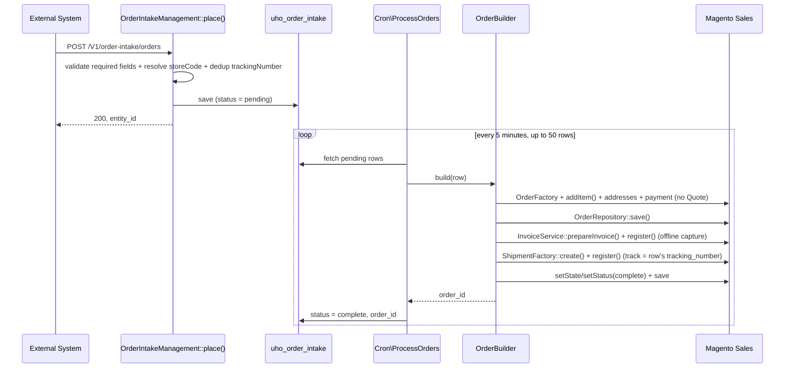

# Uho_OrderIntake

> Accepts external order payloads via REST, stores them for asynchronous processing, and turns
> them into complete, invoiced, shipped Magento orders via a background cron — without going
> through Magento's Quote/checkout pipeline.

## Overview

An external system hands off orders to Magento using a flat JSON payload (store code, total,
customer name, phone, city, optional delivery method, tracking number) via a single REST
endpoint. The endpoint validates and stores the payload synchronously; a cron job then builds a
real Sales Order — shipped via Nova Poshta pickup, paid cash-on-delivery, invoiced, shipped, and
moved to `complete` — entirely in the background, without the external system needing to know
anything about Magento's checkout internals (quotes, shipping rate collection, catalog product
IDs).

**Environments**: All (currently exercised against the `pr_ua` / Проросток store view)
**Version**: 1.0.0 (initial delivery; module lives under `app/code`, no `composer.json`)
**Author**: Uho

Design spec: `docs/superpowers/specs/2026-09-03-order-intake-design.md`
Implementation plan: `docs/superpowers/plans/2026-09-03-order-intake-plan.md`

## Features

- `POST /V1/order-intake/orders` REST endpoint, admin-token-authenticated, with required-field
  validation, store-code resolution, and tracking-number deduplication at submission time
- Background cron (every 5 minutes, up to 50 rows/run) that builds, invoices, ships, and completes
  a real Magento order per row — bypassing the Quote pipeline entirely
- Two placeholder catalog products used as generic line items until real product mapping exists
- Per-row error tracking (`status = error` + `error_message`) with manual requeue; one bad row
  never aborts the rest of the batch

## Architecture

### Dependencies

| Module | Purpose |
|--------|---------|
| `Magento_Sales` | Order/Invoice/Shipment construction |
| `Magento_Catalog` | Placeholder line-item products, `ProductRepositoryInterface` |
| `Magento_Directory` | UA country/address fields on the order |
| `Magento_Webapi` | REST service-contract exposure (`webapi.xml`) |
| `Uho_NovaposhtaShipping` | `NovaposhtaManual::CARRIER_CODE`/`METHOD_CODE` constants, reused for both `shipping_method` and the shipment track's `carrier_code` |

### Key Components

| Component | Type | Description |
|-----------|------|-------------|
| `Api\Data\OrderIntakeInterface` | Data Interface | `uho_order_intake` row DTO — typed getters/setters plus `STATUS_*` constants |
| `Model\OrderIntake` / `Model\ResourceModel\OrderIntake` / `...\Collection` | Model / ResourceModel / Collection | Standard CRUD for the intake table. The resource model adds `trackingNumberExists(string): bool`, a direct query used for the dedup check |
| `Api\OrderIntakeManagementInterface` / `Model\OrderIntakeManagement` | Service Contract / Model | `place(...): int` — validates and persists a row with `status = pending`, returns the new entity ID |
| `Api\GetOrderProductInterface` / `Model\GetOrderProduct` | Service Contract / Model (stub) | Intended to map a store + total to real catalog products. **Always returns `[]` today** — see Known Limitations |
| `Model\TotalSplitter` | Model | Splits a whole-currency-unit total into positive whole-unit parts for the placeholder-product fallback |
| `Model\OrderBuilder` | Model | Core order-construction logic: resolves line items, builds the guest customer/address/payment/shipping data, constructs the Order directly, invoices it, ships it, and marks it complete |
| `Cron\ProcessOrders` | Cron | Batch-processes up to 50 `pending` rows per run; catches and records per-row failures without aborting the batch |
| `Setup\Patch\Data\CreatePlaceholderProducts` | Data Patch | Creates the `order-misc-1` / `order-misc-2` simple products used as fallback line items |

### Architecture decision: direct Order construction, no Quote

`OrderBuilder` constructs the Sales Order **directly** via `OrderFactory` + `OrderRepository` — it
never creates or submits a `Quote`. This is deliberate, not an oversight:
`Uho\NovaposhtaCheckout\Observer\SalesModelServiceQuoteSubmitBefore` is a fail-closed guard on the
`sales_model_service_quote_submit_before` event that blocks placing an order using the Nova Poshta
carrier without a composed warehouse ref — a ref this module doesn't have yet (see Known
Limitations). That event is dispatched exclusively during Quote submission, so building the Order
directly means it structurally cannot fire on this path, leaving the guard fully intact for real
checkout/admin order creation. Verified empirically during implementation: no row was ever added
to the `quote` table while the cron ran, and every test order completed successfully without the
guard's `LocalizedException` ever surfacing.

### Sequence



## API

### REST Endpoints

| Method | URL | ACL | Description |
|--------|-----|-----|-------------|
| `POST` | `/V1/order-intake/orders` | `Uho_OrderIntake::orders` | Validates and stores one intake row as `pending`. Does **not** create the Magento order synchronously — an admin-issued integration token is required (not anonymous) |

### Request/Response Example

```json
// POST /V1/order-intake/orders
{
  "storeCode": "pr_ua",
  "total": 350,
  "customerName": "Іванова Марія",
  "phone": "+380671234567",
  "city": "Київ",
  "deliveryMethod": "самовивіз",
  "trackingNumber": "20450123456789"
}
```

`200` response body is the new row's integer entity ID (e.g. `1`).

**Validation errors** (both surface as HTTP 400):
- `InputException`, aggregated — one entry per blank/missing required field (`storeCode`,
  `customerName`, `phone`, `city`, `trackingNumber`) or a non-positive `total`
- `LocalizedException` — `storeCode` doesn't resolve to an existing, active store view, or
  `trackingNumber` already exists (dedup happens here, at the endpoint — not in the cron)

## Database

### Tables

| Table | Description |
|-------|-------------|
| `uho_order_intake` | One row per external order payload; tracks its lifecycle from intake through order creation |

### Schema

| Column | Type | Description |
|--------|------|-------------|
| `entity_id` | `int unsigned`, PK, auto-increment | |
| `store_code` | `varchar(32)` | e.g. `pr_ua` |
| `total` | `decimal(12,4)` | order total from the payload |
| `customer_name` | `varchar(255)` | |
| `phone` | `varchar(32)` | |
| `city` | `varchar(255)` | |
| `delivery_method` | `varchar(64)`, nullable | stored for reference only — never used to branch cron logic; the cron always creates a Nova Poshta pickup order regardless |
| `tracking_number` | `varchar(64)`, **unique** | dedup key at the endpoint; also becomes the shipment track number |
| `status` | `varchar(16)`, default `pending` | `pending` \| `complete` \| `error` |
| `order_id` | `int unsigned`, nullable | set once the Magento order is created |
| `error_message` | `text`, nullable | set when `status = error` |
| `created_at` / `updated_at` | `timestamp` | |

**Indexes** (implementation detail beyond the original spec): a `status` btree index was added
alongside the unique `tracking_number` constraint — the cron filters `WHERE status = 'pending'` on
every run, so this keeps that lookup cheap as the table grows.

No admin grid UI. Rows are inspected via direct DB query.

## Cron Jobs

| Job | Schedule | Description |
|-----|----------|-------------|
| `uho_orderintake_process_orders` | `*/5 * * * *` | Fetches up to 50 `pending` rows, builds/invoices/ships/completes an order per row via `OrderBuilder`, and updates each row's `status`/`order_id`/`error_message`. Failures are caught per row (`Throwable`, deliberately broader than `\Exception` so one corrupt row can't kill the batch) and logged; the batch continues to the next row |

## Testing

25 unit tests / 836 assertions under `Test/Unit/`:

- `Model/OrderIntakeManagementTest` — aggregated required-field validation, non-positive-total
  rejection, unknown/inactive store rejection, duplicate-tracking-number rejection, happy path
- `Model/TotalSplitterTest` — invariants (both parts whole, both `> 0`, sum equals input) across a
  range of totals including the documented `total = 1` and `total = 2` edge cases
- `Model/GetOrderProductTest` — confirms the stub always returns `[]`
- `Cron/ProcessOrdersTest` — batch filtering/paging, success and failure bookkeeping, and that the
  batch continues past a failing row

Run:
```bash
warden shell -c "vendor/bin/phpunit -c dev/tests/unit/phpunit.xml.dist --testsuite Magento_Unit_Tests_App_Code --filter 'Uho\\OrderIntake'"
```

No storefront/UI testing needed — this is a pure backend integration surface.

## Known Limitations / Deferred Work

Carried over from the design spec, plus implementation notes on how each is currently handled:

- **Real product mapping.** `GetOrderProductInterface::execute()` always returns `[]`. The cron
  always falls back to the two placeholder products (`order-misc-1`/`order-misc-2`) split via
  `TotalSplitter`. `OrderBuilder`'s handling of a hypothetical non-empty `GetOrderProductInterface`
  result is untested, unexercised dead code today — flagged inline in `OrderBuilder` pending a real
  implementation of the service.
- **Real Nova Poshta warehouse/address resolution.** The payload only carries a city name, so the
  order's billing/shipping address uses fixed placeholder `street`/`postcode`/`region` values
  (`OrderBuilder::buildAddress()`, flagged inline). A future service should resolve these from
  `city` (and possibly `trackingNumber`) via the Nova Poshta API.
- **No admin grid** for `uho_order_intake` — only add one if this becomes a routine operational
  need.
- **No automatic retry** for `error` rows — a failed row stays `error` until someone investigates
  and requeues it manually (reset `status` back to `pending` directly in the DB).

### Other implementation decisions not in the original spec

- **Placeholder products are assigned to every website** (`CreatePlaceholderProducts` data patch).
  Not called out in the original plan, but needed so `OrderBuilder` can load them by SKU in a
  store-scoped context (`ProductRepositoryInterface::get($sku, false, $storeId)`).
- **The same data patch emulates the admin area** (`State::setAreaCode(Area::AREA_ADMINHTML)`)
  before saving the products. `bin/magento setup:upgrade` doesn't set an area code by default, and
  product save triggers URL-rewrite generation that requires one — a standard, well-precedented
  Magento pattern for this exact failure mode.
- **`TotalSplitter` returns a single-element array for `total = 1`.** Splitting into "two parts,
  each `> 0`" is mathematically impossible for a total of 1, so a documented single-item split is
  returned instead of throwing.
- **Shipment items must be passed as an explicit `item_id => qty` map.** An empty array to
  `ShipmentFactory::create()` means "ship nothing" for non-dummy items (not "ship everything" as
  initially assumed by analogy with `InvoiceService::prepareInvoice()`) — this was caught by a
  `"We cannot create an empty shipment."` failure during live cron testing and fixed by building
  the map explicitly from `$order->getAllItems()`, mirroring core's own
  `Order\Invoice\Save::_prepareShipment()`.
