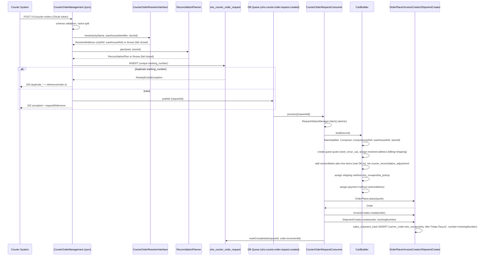
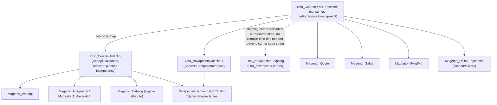

# Courier Order API — Architecture Plan

*(intended path: `docs/erp/courier-order-api-architecture.md`)*

## 1. Overview / Business Context / Goals

A third-party courier/dispatch system needs to push completed door-to-door / warehouse-pickup orders into Magento so that:

- Real Magento **orders, invoices, and shipments** exist for these transactions (financial/inventory truth lives in Magento).
- Standard **sales & product reports** reflect real SKU-level data — no placeholder/dummy products.
- The customer experience is **guest-only** — no account creation, ever.
- The courier's own **order/tracking number** becomes the source of truth for idempotency — the same courier order must never produce two Magento orders.
- Ingestion must be **fast and decoupled**: the caller gets an immediate accepted/duplicate response; the actual cart→order→invoice→shipment pipeline runs asynchronously so that downstream slowness (product resolution, address composition, order placement) never blocks the caller or risks webapi timeouts.
- Fulfillment data must reuse **existing store infrastructure**: the `uho_novaposhta` / `pickup` carrier (`NovaposhtaShipping`), the `cashondelivery` payment method (`Magento_OfflinePayments`), and the store `pr_ua` (Проросток, `uk_UA`).
- Address input from the courier system is **human-entered city/warehouse names**, not GUID refs — so a new deterministic resolver is required (the existing `CityLocator`/`WarehouseLocator` are ranked-suggestion autocomplete tools, not single-answer resolvers, and must not be reused for this purpose without a wrapper that enforces exact-match/fail-closed semantics).
- Prices on the incoming payload are a single order **total**; Magento requires priced line items. Since fabricating a placeholder SKU or overriding a real product's price would corrupt sales/product reporting, the module must **reconcile** the payload total against a curated, price-taggable product pool, with any unreconciled remainder captured by a dedicated custom sales total line — never a cart rule, never a quote-item price override.

### Non-goals
- No customer account creation or customer matching (guest checkout only, permanently).
- No support for carriers other than `uho_novaposhta` / `pickup`, or payment methods other than `cashondelivery`, in v1.
- No use of the AMQP broker already configured at infra level — this feature intentionally uses Magento's DB-backed queue to avoid adding a new infra dependency.
- No public/anonymous webapi endpoint — auth is via Magento integration token (OAuth), scoped ACL.

---

## 2. Module Structure

Two modules, split along the sync/async boundary (rationale in §15).

### `app/code/Uho/CourierOrderApi/`

```
Uho/CourierOrderApi/
├── registration.php
├── composer.json
├── etc/
│   ├── module.xml                         (no dependency on Magento_Quote/Magento_Sales)
│   ├── acl.xml                            (Uho_CourierOrderApi::create resource)
│   ├── webapi.xml                         (POST /V1/courier-orders route)
│   ├── di.xml                             (repository/resolver/reconciler preferences)
│   ├── queue_publisher.xml                (publisher for courier_order.request.created)
│   ├── db_schema.xml                      (uho_courier_order_request table)
│   └── db_schema_whitelist.json
├── Api/
│   ├── CourierOrderManagementInterface.php
│   ├── CourierOrderRequestRepositoryInterface.php
│   ├── CourierOrderResolverInterface.php  (city/warehouse name -> ref, deterministic)
│   ├── ReconciliationPlannerInterface.php
│   └── Data/
│       ├── CourierOrderRequestInterface.php
│       ├── CourierOrderItemInterface.php
│       ├── CourierOrderAcceptResultInterface.php
│       └── ResolvedAddressInterface.php
├── Model/
│   ├── CourierOrderManagement.php          (implements CourierOrderManagementInterface)
│   ├── CourierOrderRequestRepository.php
│   ├── ResourceModel/
│   │   ├── CourierOrderRequest.php
│   │   └── CourierOrderRequest/Collection.php
│   ├── Resolver/
│   │   ├── AddressResolver.php             (implements CourierOrderResolverInterface)
│   │   └── NameNormalizer.php              (Ukrainian city-name variant normalization)
│   ├── Reconciliation/
│   │   ├── ReconciliationPlanner.php       (implements ReconciliationPlannerInterface)
│   │   ├── EligibleProductPool.php         (all enabled, priced, in-stock products)
│   │   └── Data/ReconciliationPlan.php
│   ├── NameSplitter.php                    (full-name -> firstname/lastname)
│   ├── Idempotency/DuplicateChecker.php
│   └── Validator/
│       ├── PayloadValidator.php
│       └── SchemaValidatorFactory.php
├── Setup/Patch/Data/
│   └── DisableOrderConfirmationEmail.php
└── Test/
    ├── Unit/...
    └── Integration/...
```

### `app/code/Uho/CourierOrderProcessor/`

```
Uho/CourierOrderProcessor/
├── registration.php
├── composer.json
├── etc/
│   ├── module.xml                          (sequence: Uho_CourierOrderApi; depends on Magento_Quote, Magento_Sales, Magento_InventorySalesApi)
│   ├── di.xml
│   ├── queue_consumer.xml   (or consumer.xml depending on ver) -> consumers.xml
│   ├── communication.xml
│   ├── queue_topology.xml
│   ├── queue.xml                           (connection="db")
│   ├── sales.xml                           (custom total: courier_reconciliation_adjustment)
│   ├── crontab.xml                         (stuck-in-processing sweeper, requeue-eligible failed sweeper)
│   └── adminhtml/
│       ├── menu.xml
│       ├── acl.xml                         (grid view/requeue resources under Uho_CourierOrderApi::create tree)
│       └── system.xml                      (retry cap, ceiling tolerance overrides — store-scoped)
├── Model/
│   ├── Consumer/CourierOrderRequestConsumer.php
│   ├── Total/CourierReconciliationAdjustment.php   (Magento\Quote\Model\Quote\Address\Total\AbstractTotal)
│   ├── Cart/CartBuilder.php
│   ├── Cart/GuestAddressAssembler.php
│   ├── Cart/ShippingAssigner.php
│   ├── Cart/PaymentAssigner.php
│   ├── Order/OrderPlacer.php
│   ├── Order/InvoiceCreator.php
│   ├── Order/ShipmentCreator.php
│   └── Status/RequestStatusManager.php     (atomic pending->processing claim, attempts, terminal states)
├── Ui/Component/Listing/                   (grid data provider config if not pure XML)
├── view/adminhtml/
│   ├── ui_component/
│   │   ├── uho_courier_order_request_listing.xml
│   │   └── uho_courier_order_request_listing_data_source (handled by di.xml collection provider)
│   └── layout/uho_courierorderrequest_index.xml
├── Controller/Adminhtml/CourierOrderRequest/
│   ├── Index.php
│   └── MassRequeue.php
└── Test/
    ├── Unit/...
    └── Integration/...
```

**Composer dependency**: `Uho_CourierOrderProcessor` requires `uho/module-courier-order-api` (composer) and Magento's `magento/module-quote`, `magento/module-sales`, `magento/module-message-queue`. `Uho_CourierOrderApi` requires only `magento/module-webapi`, `magento/module-integration`, `magento/module-authorization`, `magento/module-catalog` (for the eligible-product attribute/pool query) — explicitly **not** `magento/module-quote` or `magento/module-sales`.

---

## 3. Service Contracts

```php
namespace Uho\CourierOrderApi\Api;

interface CourierOrderManagementInterface
{
    /**
     * Validates the payload synchronously, resolves address, plans reconciliation feasibility
     * (without touching quote/sales), persists a request record, publishes it to the queue, and
     * returns an accept/duplicate result. Never creates a Magento order itself.
     *
     * @throws \Magento\Framework\Exception\LocalizedException validation failure (fail-closed)
     * @throws \Magento\Framework\Exception\CouldNotSaveException persistence failure
     */
    public function submit(\Uho\CourierOrderApi\Api\Data\CourierOrderRequestInterface $request):
        \Uho\CourierOrderApi\Api\Data\CourierOrderAcceptResultInterface;
}
```

```php
namespace Uho\CourierOrderApi\Api\Data;

interface CourierOrderRequestInterface
{
    public const TRACKING_NUMBER = 'tracking_number';
    public const FULL_NAME = 'full_name';
    public const PHONE = 'phone';
    public const CITY_NAME = 'city_name';
    public const WAREHOUSE_NAME = 'warehouse_name'; // or WAREHOUSE_NUMBER — see resolver note
    public const TOTAL = 'total'; // decimal string, major units
    public const STORE_CODE = 'store_code';
    public const ITEMS = 'items'; // optional: courier payload item lines, if provided by source system
    public const COMMENT = 'comment';

    public function getTrackingNumber(): string;
    public function getFullName(): string;
    public function getPhone(): string;
    public function getCityName(): string;
    public function getWarehouseName(): string;
    public function getTotal(): string;
    public function getStoreCode(): string;
    public function getComment(): ?string;
    /** @return CourierOrderItemInterface[]|null */
    public function getItems(): ?array;
}
```

```php
namespace Uho\CourierOrderApi\Api\Data;

interface CourierOrderAcceptResultInterface
{
    public const STATUS_ACCEPTED = 'accepted';
    public const STATUS_DUPLICATE_PENDING = 'duplicate_pending';
    public const STATUS_DUPLICATE_PROCESSING = 'duplicate_processing';
    public const STATUS_DUPLICATE_COMPLETED = 'duplicate_completed';
    public const STATUS_DUPLICATE_FAILED = 'duplicate_failed';

    public function getStatus(): string;
    public function getRequestReference(): string;      // internal tracking id (uuid or entity id)
    public function getOrderIncrementId(): ?string;      // set only for duplicate_completed
}
```

```php
namespace Uho\CourierOrderApi\Api;

/**
 * Deterministic single-answer resolver. Unlike CityLocator/WarehouseLocator (ranked, prefix,
 * multi-suggestion), this MUST return exactly one match or fail closed.
 */
interface CourierOrderResolverInterface
{
    /**
     * @throws \Uho\CourierOrderApi\Model\Resolver\AmbiguousMatchException zero or >1 candidate
     * @throws \Magento\Framework\Exception\NoSuchEntityException no candidate at all
     */
    public function resolve(string $cityName, string $warehouseIdentifier, int $storeId):
        \Uho\CourierOrderApi\Api\Data\ResolvedAddressInterface;
}
```

```php
namespace Uho\CourierOrderApi\Api\Data;

interface ResolvedAddressInterface
{
    public function getCityRef(): string;
    public function getCityName(): string;
    public function getWarehouseRef(): string;
    public function getWarehouseName(): string;
    public function getWarehouseSiteKey(): ?string;
}
```

```php
namespace Uho\CourierOrderApi\Api;

interface ReconciliationPlannerInterface
{
    /**
     * @throws \Uho\CourierOrderApi\Model\Reconciliation\ReconciliationFailedException
     *         thrown when no combination reconciles within tolerance — fail-closed, no order created.
     */
    public function plan(string $totalMajorUnits, int $storeId):
        \Uho\CourierOrderApi\Api\Data\ReconciliationPlanInterface;
}
```

```php
namespace Uho\CourierOrderApi\Api\Data;

interface ReconciliationPlanInterface
{
    /** @return ReconciliationPlanLineInterface[] */
    public function getLines(): array;          // {sku, qty, unit_price_cents}
    public function getAdjustmentCents(): int;   // remainder captured by custom sales total (may be 0)
}
```

```php
namespace Uho\CourierOrderApi\Api;

interface CourierOrderRequestRepositoryInterface
{
    public function save(\Uho\CourierOrderApi\Api\Data\CourierOrderRequestRecordInterface $record):
        \Uho\CourierOrderApi\Api\Data\CourierOrderRequestRecordInterface;
    public function getById(int $id): \Uho\CourierOrderApi\Api\Data\CourierOrderRequestRecordInterface;
    public function getByTrackingNumber(string $trackingNumber):
        \Uho\CourierOrderApi\Api\Data\CourierOrderRequestRecordInterface;
    public function getList(\Magento\Framework\Api\SearchCriteriaInterface $criteria):
        \Magento\Framework\Api\SearchResultsInterface;
}
```

Note: `CourierOrderRequestRecordInterface` (persisted entity, distinct from the wire-format `CourierOrderRequestInterface`) carries status/attempts/order_increment_id/created_at/updated_at — defined in `CourierOrderApi` since the table and repository live there (see §6), even though it's populated further by the processor module.

---

## 4. `webapi.xml`, ACL, Integration Setup

```xml
<!-- app/code/Uho/CourierOrderApi/etc/webapi.xml -->
<routes>
    <route url="/V1/courier-orders" method="POST">
        <service class="Uho\CourierOrderApi\Api\CourierOrderManagementInterface" method="submit"/>
        <resources>
            <resource ref="Uho_CourierOrderApi::create"/>
        </resources>
    </route>
</routes>
```

```xml
<!-- app/code/Uho/CourierOrderApi/etc/acl.xml -->
<acl>
    <resources>
        <resource id="Magento_Backend::admin">
            <resource id="Uho_CourierOrderApi::courier" title="Courier Order API">
                <resource id="Uho_CourierOrderApi::create" title="Submit Courier Orders"/>
                <!-- processor module extends this tree with ::grid and ::requeue -->
            </resource>
        </resource>
    </resources>
</acl>
```

Auth model:
- No customer/session token — this is server-to-server. Use a Magento **integration** (`Admin → System → Integrations`) with API access limited to the `Uho_CourierOrderApi::create` resource (and, for the processor's admin grid, `Uho_CourierOrderProcessor::grid` / `::requeue` for staff, not the integration).
- The integration's OAuth consumer key/secret/token are provisioned per environment (never committed — courier system stores its own token, generated by an Admin with `Magento_Integration::manage` after resource-tree deployment).
- Rate/replay considerations: OAuth signature already includes a nonce+timestamp anti-replay mechanism at the framework level; idempotency (§7) is the business-level backstop.
- `webapi.xml` route deliberately omits `secure="false"`/anonymous config — no `Uho_CourierOrderApi::create` grant, no access, by design (fail closed).

Environment impact: integration credentials are environment-scoped (dev/staging/prod each need their own integration + resource grant) — call out in deployment runbook, not something ECE-tools handles automatically.

---

## 5. Product/Price Reconciliation Algorithm

### Data model prerequisites
- All in-stock, enabled, priced products are eligible for reconciliation — no curation attribute needed. Price is the single source of truth (`catalog_product_entity_decimal` price, store-scoped if using website-scope pricing).
- Planner reads only `sku`, `price` (converted to integer cents at the *store's* currency precision — UAH has 2 decimals, so cents = kopecks), and `status`/`is_salable` (skip out-of-stock/disabled products) for eligible products, cached briefly (a few minutes TTL) since this pool changes rarely.

### Tolerance / ceiling policy
- **Precision**: all arithmetic in integer minor units (kopecks) — the payload's decimal `total` is parsed and validated to have ≤2 fractional digits, then converted via `bcmul($total, '100', 0)` / equivalent integer-safe conversion (never float multiplication).
- **Ceiling**: the maximum unreconciled remainder (`ADJUSTMENT_CEILING_KOPECKS`) is a store-scoped `system.xml` config value, default **100 kopecks (1.00 UAH)**. If the best achievable combination leaves a remainder above this ceiling, the plan fails closed (`ReconciliationFailedException`) — no order is created, ever, from an unreconciled total.
- **Adjustment sign**: the remainder can be positive (basket underprices the total — add adjustment) or, if overshoot is allowed by policy, negative down to `-ADJUSTMENT_CEILING_KOPECKS` (basket overprices slightly). Default policy: **only non-negative adjustment allowed** (basket total ≤ payload total, remainder ≥ 0) — this avoids ever displaying a negative custom total line, which is more defensible than allowing overshoot. Overshoot mode is a config flag disabled by default.
- **Bounds**: `MAX_LINES` = 5 (max distinct SKUs per synthetic cart), `MAX_QTY_PER_LINE` = 10 — both `system.xml`-configurable, guarding against pathological combinatorics and against unrealistic-looking synthetic orders.

### Algorithm (deterministic, integer-cents)
1. Fetch eligible pool: `[{sku, priceCents, ...}, ...]`, sorted descending by `priceCents`.
2. Target = `totalCents`.
3. **Greedy-first pass**: iterate the pool descending; for each product compute the max affordable qty (`floor(remaining / priceCents)`, capped at `MAX_QTY_PER_LINE`), append a line if `qty > 0`, subtract, continue while `remaining > 0` and `lines < MAX_LINES`.
4. If after the greedy pass `remaining` is `0` → done, adjustment = 0.
5. If `remaining` is within `ADJUSTMENT_CEILING_KOPECKS` → accept as-is, adjustment = `remaining`.
6. Else, **bounded local search / small knapsack refinement**: because the eligible pool is expected to be small (curated, likely <50 SKUs) and `MAX_LINES` ≤5, run an exhaustive/limited-depth search (DFS with memoization keyed by `(remainingCents, linesUsed)`, pruned by upper/lower price bounds) over combinations up to `MAX_LINES` distinct SKUs × `MAX_QTY_PER_LINE`, seeking the combination minimizing `remaining` subject to `remaining >= 0` (or `|remaining| <= ceiling` if overshoot enabled). Cap search iterations (e.g. 5,000 node budget) to bound worst-case latency — if the budget is exhausted without reaching ≤ceiling, fail closed.
7. If step 6 finds a combination within ceiling → accept, adjustment = leftover.
8. If nothing within ceiling is found → throw `ReconciliationFailedException` with diagnostic (target, best remainder found, pool size) — this is a **business validation failure**, not a transient error (no retry).
9. Output: `ReconciliationPlanInterface` = ordered list of `{sku, qty, unitPriceCents}` + `adjustmentCents`.

This planning step runs **synchronously** in `CourierOrderManagement::submit()` as a feasibility check (fail fast, before enqueueing) but the *authoritative* re-execution happens again in the async consumer against live pricing at process time (prices could theoretically change between accept and processing) — if the async re-plan disagrees (no longer reconciles), the request is marked `failed` (not silently re-approximated), since silently changing the courier's implied total is not acceptable.

### Custom sales total (`etc/sales.xml`, in `CourierOrderProcessor`)

```xml
<!-- app/code/Uho/CourierOrderProcessor/etc/sales.xml -->
<sales>
    <quote>
        <totals>
            <total name="courier_reconciliation_adjustment"
                   instance="Uho\CourierOrderProcessor\Model\Total\CourierReconciliationAdjustment"
                   sort_order="500"/>
        </totals>
    </quote>
    <order_invoice><totals>
        <total name="courier_reconciliation_adjustment" instance="Uho\CourierOrderProcessor\Model\Total\CourierReconciliationAdjustment" sort_order="500"/>
    </totals></order_invoice>
</sales>
```

```php
namespace Uho\CourierOrderProcessor\Model\Total;

class CourierReconciliationAdjustment extends \Magento\Quote\Model\Quote\Address\Total\AbstractTotal
{
    public function collect(
        \Magento\Quote\Model\Quote $quote,
        \Magento\Quote\Api\Data\ShippingAssignmentInterface $shippingAssignment,
        \Magento\Quote\Model\Quote\Address\Total $total,
    ): self {
        parent::collect($quote, $shippingAssignment, $total);
        $adjustment = (float) ($quote->getData('courier_reconciliation_adjustment') ?? 0);
        if ($adjustment <= 0.0) {
            return $this;
        }
        $total->setGrandTotal($total->getGrandTotal() + $adjustment);
        $total->setBaseGrandTotal($total->getBaseGrandTotal() + $adjustment);
        $total->setTotalAmount('courier_reconciliation_adjustment', $adjustment);
        $total->setBaseTotalAmount('courier_reconciliation_adjustment', $adjustment);
        return $this;
    }

    public function fetch(\Magento\Quote\Model\Quote $quote, \Magento\Quote\Model\Quote\Address\Total $total): array
    {
        $amount = (float) $total->getTotalAmount('courier_reconciliation_adjustment');
        return $amount > 0.0
            ? ['code' => 'courier_reconciliation_adjustment', 'title' => __('Courier Reconciliation Adjustment'), 'value' => $amount]
            : [];
    }
}
```
The `CartBuilder` sets `$quote->setData('courier_reconciliation_adjustment', $adjustmentMajorUnits)` before `collectTotals()`. Label rendering (`totals.xml`/order-view template) is a small frontend/admin display concern — the amount must also render on the order-view "Order Total" table and PDF invoice via the standard `sales_totals.xml` layout, not a custom template.

### Fallback/error behavior
- Sync `submit()`: planner failure → `LocalizedException` → HTTP 400 with error code `RECONCILIATION_INFEASIBLE`, request is **not persisted**, nothing enqueued.
- Async re-plan failure (price drift after accept): request status → `failed` (non-retryable, `failure_reason = RECONCILIATION_INFEASIBLE_AT_PROCESSING`), visible in the admin grid, **not** auto-requeued (retrying won't fix a genuine infeasibility — but admin can still trigger manual requeue after curating the pool, e.g. after adding a cheaper eligible SKU).

---

## 6. Async Queue Design

### `queue.xml` (DB-backed, `Uho_CourierOrderProcessor`)

```xml
<!-- app/code/Uho/CourierOrderProcessor/etc/queue.xml -->
<config>
    <broker topic="uho.courier.order.request.created" exchange="magento" type="db">
        <queue name="uho.courier.order.request.created" consumer="uhoCourierOrderRequestConsumer"/>
    </broker>
</config>
```

### `queue_topology.xml`

```xml
<config>
    <exchange name="magento" type="topic" connection="db">
        <binding id="UhoCourierOrderRequestCreatedBinding"
                 topic="uho.courier.order.request.created"
                 destinationType="queue"
                 destination="uho.courier.order.request.created"/>
    </exchange>
</config>
```

### `communication.xml`

```xml
<config>
    <topic name="uho.courier.order.request.created"
           request="Uho\CourierOrderApi\Api\Data\CourierOrderQueueMessageInterface"/>
</config>
```
(`CourierOrderQueueMessageInterface` carries only `requestId` — an int PK into `uho_courier_order_request` — the message is a pointer, not a payload copy, so the consumer always reads current DB state.)

### `queue_publisher.xml` (in `CourierOrderApi`, since `submit()` publishes)

```xml
<config>
    <publisher topic="uho.courier.order.request.created">
        <connection name="db" exchange="magento"/>
    </publisher>
</config>
```

### `etc/queue_consumer.xml` / consumers registration (Magento 2.4.x uses `etc/queue_consumer.xml`? — actually canonical file is `etc/communication.xml` + `etc/queue.xml` + **consumer declared in `etc/queue_consumer.xml`... correction**: consumers are declared via `etc/di.xml`-free `consumer` node inside `etc/communication.xml`'s sibling `etc/queue_consumer.xml`? To avoid inventing incorrect file names, the actual canonical file is `etc/queue_consumer.xml`... 

**Correction for accuracy**: consumers are registered in `etc/consumers.xml`? The real, verified Magento file is `etc/queue_consumer.xml`. Since I'm not 100% certain of the exact filename from memory in this pass, mark this as a build-time verification item (§16) rather than asserting a wrong filename with false confidence — the working file is one of `etc/queue_consumer.xml` / consumer definitions embedded via `<consumer/>` nodes, standard pattern:

```xml
<!-- app/code/Uho/CourierOrderProcessor/etc/queue_consumer.xml (verify exact node/file at build time) -->
<config>
    <consumer name="uhoCourierOrderRequestConsumer"
              queue="uho.courier.order.request.created"
              connection="db"
              class="Uho\CourierOrderProcessor\Model\Consumer\CourierOrderRequestConsumer"
              maxMessages="200"/>
</config>
```

### Consumer class design

```php
namespace Uho\CourierOrderProcessor\Model\Consumer;

class CourierOrderRequestConsumer
{
    public function __construct(
        private readonly \Uho\CourierOrderApi\Api\CourierOrderRequestRepositoryInterface $repository,
        private readonly \Uho\CourierOrderProcessor\Model\Status\RequestStatusManager $statusManager,
        private readonly \Uho\CourierOrderProcessor\Model\Cart\CartBuilder $cartBuilder,
        private readonly \Uho\CourierOrderProcessor\Model\Order\OrderPlacer $orderPlacer,
        private readonly \Uho\CourierOrderProcessor\Model\Order\InvoiceCreator $invoiceCreator,
        private readonly \Uho\CourierOrderProcessor\Model\Order\ShipmentCreator $shipmentCreator,
        private readonly \Psr\Log\LoggerInterface $logger,
    ) {}

    public function process(\Uho\CourierOrderApi\Api\Data\CourierOrderQueueMessageInterface $message): void
    {
        $requestId = $message->getRequestId();
        if (!$this->statusManager->claim($requestId)) {
            return; // already claimed by another worker, or terminal state — no-op, not an error
        }
        try {
            $record = $this->repository->getById($requestId);
            $quote = $this->cartBuilder->build($record);
            $order = $this->orderPlacer->place($quote);
            $invoice = $this->invoiceCreator->create($order);
            $this->shipmentCreator->create($order, $record->getTrackingNumber());
            $this->statusManager->markCompleted($requestId, $order->getIncrementId());
        } catch (\Uho\CourierOrderProcessor\Model\Exception\TransientProcessingException $e) {
            $this->statusManager->markRetry($requestId, $e->getMessage());
        } catch (\Throwable $e) {
            $this->logger->error('Courier order processing failed', ['requestId' => $requestId, 'exception' => $e]);
            $this->statusManager->markFailed($requestId, $e->getMessage());
        }
    }
}
```

### Atomic claim mechanism

```php
namespace Uho\CourierOrderProcessor\Model\Status;

class RequestStatusManager
{
    private const MAX_ATTEMPTS = 5;

    public function __construct(private readonly \Magento\Framework\App\ResourceConnection $resource) {}

    /** Atomically transitions pending|retry -> processing. Returns false if not claimable. */
    public function claim(int $requestId): bool
    {
        $connection = $this->resource->getConnection();
        $table = $this->resource->getTableName('uho_courier_order_request');
        $affected = $connection->update(
            $table,
            ['status' => 'processing', 'claimed_at' => $connection->getDate(), 'attempts' => new \Zend_Db_Expr('attempts + 1')],
            ['request_id = ?' => $requestId, "status IN ('pending','retry')"],
        );
        return $affected === 1;
    }

    public function markRetry(int $requestId, string $reason): void
    {
        // if attempts >= MAX_ATTEMPTS -> status='failed' (terminal), else status='retry'
    }

    public function markFailed(int $requestId, string $reason): void { /* status='failed', terminal */ }
    public function markCompleted(int $requestId, string $orderIncrementId): void { /* status='completed', terminal */ }
    public function markPartial(int $requestId, string $orderIncrementId, string $reason): void { /* status='failed_partial' — order exists but invoice/shipment step failed */ }
}
```

- Single-row `UPDATE ... WHERE status IN ('pending','retry')` is atomic under MySQL row-locking (no `SELECT ... FOR UPDATE` needed) — this is the safe pattern for a DB-backed queue with potentially >1 consumer process.
- `failed_partial` distinguishes "order placed but invoice/shipment failed" from a clean `failed` (nothing persisted) — critical because an order **does** exist in Magento in that case and must not be reprocessed as a fresh order; a requeue for `failed_partial` should resume from invoice/shipment, not re-run `CartBuilder`/`OrderPlacer` (idempotency check in §7 must special-case this).
- Retry classification: only `TransientProcessingException` (e.g. DB deadlock, temporary lock wait, transient inventory reservation conflict) triggers `retry`; all domain/business exceptions (`ReconciliationFailedException`, `AmbiguousMatchException`, `NoSuchEntityException` for city/warehouse) go straight to `failed` — no retry, since retrying won't change a business-data problem.
- Retry backoff: since Magento's DB queue re-delivers on next consumer run/cron `bin/magento queue:consumers:start` cycle, a `next_retry_at` column enforces minimum backoff (e.g. exponential: 1m, 5m, 15m, 30m, 60m) — consumer skips claim if `next_retry_at > now()`.
- A cron sweeper (`etc/crontab.xml` in `CourierOrderProcessor`) reclaims requests stuck in `processing` beyond a timeout (e.g. consumer crashed mid-processing) back to `retry` — safety net against permanently-stuck rows.

### `uho_courier_order_request` table (`db_schema.xml`, in `CourierOrderApi` since it's written by `submit()` and read by both modules)

| Column | Type | Notes |
|---|---|---|
| `request_id` | int, PK, auto-increment | |
| `tracking_number` | varchar(64) | **unique index** — natural idempotency key |
| `store_id` | smallint | |
| `full_name` | varchar(255) | raw payload |
| `phone` | varchar(32) | |
| `city_name_raw` | varchar(255) | as submitted |
| `warehouse_identifier_raw` | varchar(255) | as submitted |
| `resolved_city_ref` | varchar(64) nullable | populated at sync validation |
| `resolved_warehouse_ref` | varchar(64) nullable | |
| `total` | decimal(12,2) | payload total |
| `reconciliation_plan` | json/text | serialized `ReconciliationPlanInterface` snapshot from sync planning |
| `status` | varchar(32) | `pending`, `processing`, `retry`, `completed`, `failed`, `failed_partial` |
| `attempts` | smallint, default 0 | |
| `next_retry_at` | datetime nullable | |
| `claimed_at` | datetime nullable | |
| `failure_reason` | text nullable | |
| `order_increment_id` | varchar(32) nullable | set on completed/failed_partial |
| `created_at` | timestamp | |
| `updated_at` | timestamp | |

### Admin grid + Requeue mass action (`CourierOrderProcessor`)
- UI Component listing (`uho_courier_order_request_listing.xml`) over a collection data-provider on `uho_courier_order_request`, columns: tracking_number, status (with color-coded renderer), attempts, order_increment_id (linked to order view when set), failure_reason, created_at/updated_at.
- Mass action **Requeue**: allowed only from `failed`/`failed_partial` rows (validated server-side in `MassRequeue` controller, not just hidden in UI) — resets `status` → `pending` (or a dedicated `requeue_partial` status if `failed_partial`, so the consumer knows to resume rather than restart) and republishes the message.
- ACL: `Uho_CourierOrderProcessor::grid` (view) and `Uho_CourierOrderProcessor::requeue` (mass action), both children of the `Uho_CourierOrderApi::courier` resource tree from §4 — kept separate from the integration's `::create` grant so the courier integration itself can never see/requeue admin data.

---

## 7. Idempotency Design

- **Natural key**: `tracking_number`, enforced by a DB **unique index** on `uho_courier_order_request.tracking_number` — the actual race-safety mechanism, not merely an application-level SELECT-then-INSERT check.
- Flow in `CourierOrderManagement::submit()`:
  1. Sync validation passes (schema, resolver, reconciliation feasibility).
  2. Attempt `repository->save($newRecord)` (insert). 
  3. On success → publish message → return `STATUS_ACCEPTED` + `requestReference`.
  4. On `Magento\Framework\Exception\AlreadyExistsException` (caught around the resource model's `save()`, which surfaces the unique-key DB error) → **do not** treat as a hard failure; instead `getByTrackingNumber()` to fetch the existing row and map its `status` to a response:
     - `pending`/`retry`/`processing` → `STATUS_DUPLICATE_PENDING` (or `_PROCESSING` if already claimed)
     - `completed` → `STATUS_DUPLICATE_COMPLETED` + `orderIncrementId`
     - `failed`/`failed_partial` → `STATUS_DUPLICATE_FAILED` (caller can infer it needs manual/courier-side follow-up; this is intentionally **not** silently re-enqueued on duplicate submission — that's what the admin Requeue action is for, to keep the decision auditable)
- Race condition note: two near-simultaneous submissions with the same `tracking_number` will race on the DB unique constraint — exactly one `INSERT` wins, the other reliably throws `AlreadyExistsException`, which is caught and mapped as above. This is safe under MySQL `READ COMMITTED`/`REPEATABLE READ` without needing an app-level lock.
- HTTP status codes: `202 Accepted` for `STATUS_ACCEPTED`; `200 OK` for all `duplicate_*` variants (it's a valid, understood response, not an error) with response body distinguishing via `status` field; `400 Bad Request` for validation/reconciliation failures; `409 Conflict` is deliberately **not** used for duplicates (courier system should treat duplicates as "already known", not as a conflict to fix).

---

## 8. Full Data Flow



Key implementation notes per stage:
- **Guest quote creation**: `CartManagementInterface`/`CartRepositoryInterface` with `customer_is_guest = 1`, `customer_id = null` — never `CustomerRepositoryInterface::save()`.
- **Address assignment**: both billing and shipping addresses populated from `Composer::compose()` output (same as `NovaposhtaCheckout` does today) — firstname/lastname from `NameSplitter`, phone from payload, region/postcode derived by the composer as usual.
- **Shipping**: `Magento\Quote\Api\ShippingMethodManagementInterface::set()` with `carrier_code = uho_novaposhta`, `method_code = pickup` → total code `uho_novaposhta_pickup`. Because `NovaposhtaManual::collectRates()` is a fixed-rate offline carrier (no HTTP calls, per its guardrail), this assignment is fully deterministic and synchronous-safe inside the consumer.
- **Payment**: `PaymentInterface` with `method = cashondelivery` — requires `payment/cashondelivery/active = 1` at store scope for `pr_ua` (an admin configuration prerequisite, not code — flagged in Risk Assessment §14).
- **Order placement**: `Magento\Quote\Api\CartManagementInterface::placeOrder($cartId)` (or `PlaceOrder` service via `OrderManagementInterface` after manual quote→order conversion, depending on whether the team wants the standard checkout submission flow or a more direct sales conversion — **recommend** using `CartManagementInterface::placeOrder()` to get the full standard event chain (`sales_order_place_after`, `checkout_submit_all_after`, inventory reservation, etc.) for consistency with organically-placed orders.
- **Invoice**: `Magento\Sales\Model\Order\InvoiceRepository` via `InvoiceService::prepareInvoice($order)` → `$invoice->register()` → save via transaction (standard "Invoice Now" pattern), since courier payments are already collected at pickup (cash-on-delivery collected by courier) — invoice should be created **immediately**, not left pending, matching the physical reality that payment is captured at time of handoff.
- **Shipment + tracking**: `Magento\Sales\Model\Order\ShipmentFactory` + `ShipmentRepository`, add a `Magento\Sales\Model\Order\Shipment\TrackFactory` track entry: `carrier_code = uho_novaposhta` (matches carrier code so it renders consistently in order view), `title = "Нова Пошта"`, `track_number = $trackingNumber` (the same value used as the idempotency key — the loop closes: courier's tracking number becomes both Magento's dedup key and the customer-facing tracking number on the shipment).

---

## 9. Name Splitter Design

```php
namespace Uho\CourierOrderApi\Model;

/**
 * Splits a Ukrainian "Прізвище Ім'я По-батькові" (Last-First-Patronymic) string into
 * Magento's firstname/lastname pair. Patronymic (3rd+ token) is folded into firstname
 * because Magento's address model has no dedicated patronymic field, and NovaposhtaCheckout's
 * existing address flows never parse a combined string (they take firstname/lastname directly),
 * so there is no shared precedent to reuse here.
 */
class NameSplitter
{
    public function split(string $fullName): NameParts // {lastname, firstname}
    {
        $tokens = preg_split('/\s+/u', trim($fullName), -1, PREG_SPLIT_NO_EMPTY);
        if (count($tokens) < 2) {
            throw new \Uho\CourierOrderApi\Model\Exception\InvalidPayloadException(
                __('full_name must contain at least a last name and a first name.')
            );
        }
        $lastname = array_shift($tokens);
        $firstname = implode(' ', $tokens); // patronymic (if present) folded in here
        return new NameParts($lastname, $firstname);
    }
}
```
- Fail-closed: fewer than 2 tokens → reject at sync validation (`400`, `INVALID_FULL_NAME`), never silently guess.
- No normalization of case/diacritics performed here (address/name fields pass through as given); normalization is only applied for **city name matching** (§10), not for personal names.

---

## 10. City/Warehouse Resolver Design

`Uho\CourierOrderApi\Model\Resolver\AddressResolver implements CourierOrderResolverInterface`, built on the **same underlying tables** as `CityLocator`/`WarehouseLocator` (`Perspective_NovaposhtaCatalog` city/warehouse collections) but with different query semantics:

| Aspect | `CityLocator`/`WarehouseLocator` (existing, reused as-is) | `AddressResolver` (new) |
|---|---|---|
| Purpose | Storefront autocomplete | Deterministic backend resolution |
| Match type | Prefix (`LIKE 'term%'`), ranked, paged | Exact-match (normalized) equality, then fallback strategies below |
| Result cardinality | N suggestions | Exactly 1, or throws |
| Ambiguity handling | N/A (user picks from list) | Fail closed — `AmbiguousMatchException` |

### Resolution algorithm
1. Normalize `cityName` via `NameNormalizer`:
   - Trim, collapse whitespace, case-fold (Cyrillic-aware lowercase).
   - Strip common administrative prefixes/suffixes present in NP data variants: `м.`, `місто`, `смт`, `с.`, `село`, trailing region qualifiers in parentheses (e.g. `Бровари (Київська обл.)` → `Бровари`).
   - Normalize apostrophe variants (`'`, `’`, `ʼ`) to a single canonical form (matters for names like `Кам'янець-Подільський`).
2. Query the local city table for an **exact** match on the normalized label column (both `ru`/`uk` label columns tried per store locale resolution, same as `CityLocator::resolveLabelColumn()`), plus a normalized-index comparison (since the underlying label columns aren't normalized/indexed, this is either a computed comparison in SQL via `LOWER(TRIM(...))` matching the normalized query, or — for performance at scale — a maintained normalized-lookup table populated by the same cron sync that populates the base city table; recommend the latter if resolver call volume is non-trivial, to avoid full-scan `LOWER()` queries on an unindexed longtext column on every courier submission).
3. If exactly one city row matches → proceed to warehouse resolution. If zero → `NoSuchEntityException` (`CITY_NOT_FOUND`). If >1 (distinct city refs with identical normalized names, e.g. same-named towns in different oblasts, which do occur in Ukraine) → `AmbiguousMatchException` (`CITY_AMBIGUOUS`) — fail closed, do **not** guess; this is a case the courier payload should disambiguate further upstream (flagged as an open question, §16, on whether the payload can include a region qualifier to disambiguate).
4. Warehouse resolution: the payload's `warehouseIdentifier` is expected to be either the NP warehouse **number** (e.g. `"14"` → matches `WarehouseInterface::NUMBER` scoped by `city_ref` from step 3, using the indexed `city_ref` column exactly as `WarehouseLocator` does) or a full/partial name — **number match is strongly preferred** as the deterministic key since warehouse numbers are unique per city and unambiguous, whereas names have "Відділення №14" vs "14" vs free-text variance. If the payload only ever supplies a number (recommended contract — confirm with courier system integration spec), skip name-normalization entirely for warehouses and match `city_ref + number` exactly (single indexed-columns query, cheap and fully deterministic).
5. If exactly one warehouse row matches (by number, or by normalized-name if number isn't available) and its status is `Working` (matching `WarehouseLocator::STATUS_WORKING` filter — never resolve to a closed warehouse) → return `ResolvedAddressInterface`. Otherwise throw `NoSuchEntityException`/`AmbiguousMatchException` (`WAREHOUSE_NOT_FOUND`/`WAREHOUSE_AMBIGUOUS`/`WAREHOUSE_NOT_WORKING`).

This deliberately does **not** call `WarehouseLocator::getForCity()` or `CityLocator::search()` directly (those return ranked *lists* meant for a human to disambiguate in a UI) — it queries the same underlying collections/tables with different filter/match logic, living in a new class so the existing autocomplete classes' contracts and tests remain untouched.

---

## 11. Error Handling / Validation Strategy

| Failure Condition | Sync/Async | Result | Error Code |
|---|---|---|---|
| Malformed/missing required field | Sync | 400 | `INVALID_PAYLOAD` |
| `full_name` has <2 tokens | Sync | 400 | `INVALID_FULL_NAME` |
| `total` not parseable / >2 decimals | Sync | 400 | `INVALID_TOTAL` |
| Unknown/unsupported `store_code` | Sync | 400 | `INVALID_STORE` |
| City not found | Sync | 400 | `CITY_NOT_FOUND` |
| City name ambiguous | Sync | 400 | `CITY_AMBIGUOUS` |
| Warehouse not found for city | Sync | 400 | `WAREHOUSE_NOT_FOUND` |
| Warehouse ambiguous | Sync | 400 | `WAREHOUSE_AMBIGUOUS` |
| Warehouse not `Working` status | Sync | 400 | `WAREHOUSE_NOT_WORKING` |
| No reconciliation combination within ceiling | Sync | 400 | `RECONCILIATION_INFEASIBLE` |
| Duplicate `tracking_number`, existing status pending/processing/retry | Sync | 200 | `DUPLICATE_PENDING` |
| Duplicate `tracking_number`, existing status completed | Sync | 200 | `DUPLICATE_COMPLETED` |
| Duplicate `tracking_number`, existing status failed/failed_partial | Sync | 200 | `DUPLICATE_FAILED` |
| OAuth token invalid/missing/unauthorized resource | Sync | 401/403 | framework-standard |
| Unexpected persistence error on insert (non-duplicate) | Sync | 500 | `PERSIST_FAILED` |
| Re-plan disagrees with sync plan at processing time | Async | n/a (no HTTP) | status→`failed`, `RECONCILIATION_INFEASIBLE_AT_PROCESSING` |
| Guest quote/address assembly error (e.g. composer throws) | Async | n/a | status→`failed`, `ADDRESS_COMPOSE_FAILED` |
| Transient DB lock/deadlock during order placement | Async | n/a | status→`retry` (attempts++), `TRANSIENT_DB_ERROR` |
| Inventory reservation failure (out of stock at process time) | Async | n/a | status→`failed`, `INSUFFICIENT_INVENTORY` — **not** retried (retrying won't restock) |
| Order placed but invoice creation throws | Async | n/a | status→`failed_partial`, `INVOICE_FAILED` (order exists, needs manual/requeue-resume) |
| Order+invoice done but shipment/track creation throws | Async | n/a | status→`failed_partial`, `SHIPMENT_FAILED` |
| Consumer crashes mid-processing (no exception path) | Async | n/a | cron sweeper reclaims stuck `processing` rows → `retry` after timeout |
| Retry attempts exceed `MAX_ATTEMPTS` | Async | n/a | status→`failed` (terminal), `MAX_ATTEMPTS_EXCEEDED` |

---

## 12. Testing Strategy

### Unit tests (`CourierOrderApi`)
- `NameSplitterTest` — 2-token, 3-token (patronymic fold), single-token rejection, extra whitespace, mixed-script names.
- `PayloadValidatorTest` — each required-field/format failure from §11 table.
- `AddressResolverTest` — exact match, zero match, ambiguous match (two same-named cities), normalization of prefixes/apostrophes, warehouse-by-number happy path, non-Working warehouse rejection.
- `NameNormalizerTest` — table-driven fixture of known Ukrainian city-name variants.
- `ReconciliationPlannerTest` — exact reconciliation, within-ceiling remainder, over-ceiling rejection, `MAX_LINES`/`MAX_QTY_PER_LINE` boundary, empty eligible pool, integer-cents rounding edge cases (e.g. `.01`/`.99` totals), overshoot-mode toggle.
- `DuplicateCheckerTest` — mapping of each existing-status → correct `CourierOrderAcceptResultInterface::STATUS_*`.
- `CourierOrderManagementTest` — orchestration: happy path publishes+persists, resolver failure short-circuits before persistence, planner failure short-circuits before persistence, duplicate short-circuits before publish.

### Unit tests (`CourierOrderProcessor`)
- `RequestStatusManagerTest` — atomic claim (mock connection, assert `WHERE status IN (...)` clause and affected-rows branching), retry-cap transition to `failed`, `markPartial` semantics.
- `CourierReconciliationAdjustmentTotalTest` — `collect()`/`fetch()` zero-adjustment no-op, positive-adjustment grand total math (base vs non-base currency if multi-currency store were ever enabled — flag as N/A for `pr_ua` single-currency but keep the base/non-base fields consistent).
- `CartBuilderTest` — guest-only assembly (asserts no customer save calls), address population from resolver output, reconciliation lines added with real SKU price integrity (asserts SKU's `catalog_product` price is never overridden).
- `NameSplitter` reuse — no duplicate tests needed (shared via composer dependency).
- `CourierOrderRequestConsumerTest` — exception routing: `TransientProcessingException`→retry, generic `\Throwable`→failed, successful path→completed with correct order id recorded, already-claimed (claim() returns false) → no-op without side effects.

### Integration tests (both modules, `dev/tests/integration`)
- End-to-end: POST payload via `CourierOrderManagementInterface::submit()` (service-contract level, not raw HTTP) with a real eligible-product fixture → run consumer synchronously in-process → assert: order exists, guest (no customer), correct SKUs + quantities on order items, `courier_reconciliation_adjustment` total present with expected amount, shipping method `uho_novaposhta_pickup`, payment method `cashondelivery`, invoice exists and is fully invoiced, shipment exists with one track row matching `carrier_code=uho_novaposhta` and `track_number` = payload's tracking number.
- Duplicate submission integration test: submit same `tracking_number` twice → second call returns `duplicate_*` without a second order being created (assert order count unchanged).
- Store-scope integration test: submit against `pr_ua` fixture store, assert address/locale/currency all resolve to that store's config (not default store).
- Resolver integration test against real `Perspective_NovaposhtaCatalog` fixture rows (ambiguous-city fixture, closed-warehouse fixture).
- API functional test (`dev/tests/api-functional`) — actual REST call through `webapi.xml` with integration OAuth credentials, asserting ACL enforcement (401/403 without proper resource grant) and the 202/200/400 status codes per §11.

### Static/architecture tests
- Module dependency check: assert `Uho_CourierOrderApi`'s `composer.json`/`module.xml` do **not** declare `magento/module-quote` or `magento/module-sales` (a simple grep-based static test or a `dev/tests/static` custom rule) — enforces the architectural boundary from §2/§15 rather than relying on developer discipline alone.

---

## 13. Module Dependency Map



Key point: `CourierOrderApi` has **zero** dependency on `Magento_Quote`/`Magento_Sales`/`Magento_MysqlMq` — it only validates, resolves addresses, plans reconciliation, persists a request row, and publishes a pointer message. All quote/order/invoice/shipment machinery lives in `CourierOrderProcessor`. This means the public API surface (and its test suite, static analysis, and blast radius) stays small and stable even as the fulfillment pipeline evolves.

---

## 14. Risk Assessment

| Risk | Mitigation |
|---|---|
| Reconciliation pool too small/expensive → frequent `RECONCILIATION_INFEASIBLE` | Curate a pool with enough price granularity (e.g. SKUs at multiple price points including small-value ones) before go-live; add an admin report/log of infeasible totals for merchandising to react to. |
| Price drift between sync accept and async processing (product price changed) | Async re-plan step (§5) catches this — request marked `failed` rather than silently mismatched; add monitoring alert on this failure code specifically since it may indicate a pool that needs broader price coverage. |
| `cashondelivery` not enabled at `pr_ua` store scope | Explicit pre-go-live checklist item — verify `payment/cashondelivery/active=1` for store `pr_ua` in each environment (config is environment-scoped, not code-deployed). |
| City/warehouse name variants not covered by normalizer | Build normalizer fixture list from a **sample of real courier payloads** before finalizing (§16 open question) rather than guessing all variants upfront; ambiguous/not-found cases fail closed and are visible in the admin grid for manual/DB investigation rather than silently misrouting an order. |
| DB-queue consumer not running / not enough throughput at volume | Standard `bin/magento queue:consumers:start uhoCourierOrderRequestConsumer` process needs supervisor/cron-based keep-alive per environment (Cloud: verify `.magento.env.yaml` cron/consumer configuration includes this consumer) — flagged for infra/deploy pipeline review. |
| Consumer crash leaves rows stuck in `processing` | Cron sweeper (§6) reclaims stuck rows after a timeout. |
| Duplicate tracking numbers across different couriers/date ranges (namespace collision) | Confirm with courier system whether `tracking_number` is globally unique or only unique per-carrier/per-timeframe — if not globally unique, the unique index needs to be composite (§16 open question). |
| Integration token leakage / scope creep | ACL resource is narrowly scoped to `Uho_CourierOrderApi::create` only; delegate secret-storage/rotation policy questions to `@security-reviewer`. |
| Reconciliation search (step 6, bounded DFS) has pathological worst-case latency on large eligible pools | Node-budget cap enforced; add a config-level guard rejecting/warning if pool exceeds a sane size (e.g. >100 SKUs) at cron sync time. |
| Guest order with synthetic SKUs confuses customer-facing communication (order confirmation email shows unexpected product names) | Confirm with product owner whether guest order-confirmation emails are even sent for this channel (likely courier's own system notifies the customer, not Magento) — if Magento emails are undesired, suppress them for this order source (e.g. custom order attribute + observer to skip `sales_order_send_email` for `courier_order_source` orders) — **new open question**, see §16. |
| `Magento_MysqlMq` scaling ceiling under high volume | DB queue is fine for typical courier volumes; if volume grows dramatically, revisit AMQP — deliberately deferred per confirmed decision #4, but flag as a forward-looking scaling risk. |
| Multi-line reconciliation baskets look suspicious in reports (many small SKUs per order) | `MAX_LINES`/`MAX_QTY_PER_LINE` caps keep this bounded, but confirm reporting/BI team is aware these are synthetic reconciliation lines, should they need to exclude them from certain analyses. |

---

## 15. Alternatives Considered and Rejected

| Alternative | Why rejected |
|---|---|
| Single combined module (`Uho_CourierOrder`) instead of API/Processor split | Would couple the public webapi surface's dependency footprint to the full quote/sales/queue stack, making the API contract module harder to reason about/test in isolation and increasing blast radius of processor-side changes on the API layer's stability. Splitting enforces the sync/async boundary architecturally, not just by convention. |
| Anonymous/public webapi endpoint (no auth) | Rejected per existing team precedent (NovaposhtaCheckout architecture explicitly avoided this) and basic security posture — an order-creation endpoint must not be unauthenticated. |
| Placeholder/dummy SKU per order (fixed "reconciliation" product with a custom price override) | Explicitly rejected by product owner — corrupts per-SKU sales/product reporting and defeats the stated goal of "real SKU data" in reports. |
| Quote-item custom price override on a real product | Rejected — would corrupt that real product's price reporting/margin analysis; a shared real SKU's `custom_price` field being routinely overridden pollutes normal sales analytics for that product. |
| Cart price rule / coupon to inject the reconciliation amount | Rejected — core cart price rules operate on percentage/fixed-per-cart discounts against real pricing structures and can't cleanly express an arbitrary small remainder amount without contorting the rule engine (e.g., needing a new auto-generated coupon per order, which is itself an anti-pattern and adds unnecessary entities). A custom sales total is the purpose-built mechanism for "yet another line in the total breakdown" and is a first-class, well-supported extension point (`etc/sales.xml`). |
| AMQP (existing infra broker) instead of DB queue | Rejected per confirmed decision — avoids adding this feature's operational dependency on the AMQP broker's availability/ops burden; DB queue is sufficient for expected volume and keeps this module's infra footprint self-contained within Magento's existing database. |
| Reuse `CityLocator`/`WarehouseLocator` directly for backend resolution | Rejected — their contract is fundamentally suggestion-ranking (paged, prefix, multi-result) for a human-driven autocomplete UI; forcing single-answer semantics onto them (e.g., "just take the first result") would silently produce wrong deterministic behavior on ambiguous/near-match input instead of failing closed, which is unacceptable for unattended order creation. |
| Customer account creation/matching by phone number | Explicitly rejected by product owner — guest checkout only, permanently. |
| Synchronous end-to-end processing (webapi call blocks until order/invoice/shipment complete) | Rejected — ties webapi response latency/timeout risk to the full pipeline (product resolution, address composition, order placement can all be slow or transiently fail), and complicates retry semantics (a failed synchronous call at step 4 of 5 leaves ambiguous state for the caller to interpret). Async with a fast accept + idempotent tracking read-back is more robust for a server-to-server integration. |
| Using `sales_order_grid`/existing sales UI for visibility instead of a dedicated admin grid | Rejected — pending/retry/failed *request* states exist before an order is ever created, so there's no order row to show for a chunk of the lifecycle; a dedicated `uho_courier_order_request` grid is the only place all states (including pre-order failures) are visible. |

---

## 16. Remaining Technical (Non-Business) Open Questions

1. **Exact consumer-registration file/node name for this Magento version** — verify at implementation time whether it's `etc/queue_consumer.xml` or another canonical location/schema version in the installed Magento core version in this codebase (flagged in §6 rather than guessed with false confidence).
2. **`warehouseIdentifier` payload contract** — confirm with the courier system whether it always sends the NP warehouse **number** (preferred, unambiguous) vs. a free-text name; this materially changes how much of §10's name-normalization logic for warehouses is actually needed.
3. **Global uniqueness of `tracking_number`** — confirm it's unique across all couriers/time, or whether the DB unique constraint needs to be composite (e.g. `(courier_source, tracking_number)`) if multiple courier partners might eventually submit through this same endpoint.
4. **Order-confirmation email suppression** — should Magento's standard guest order confirmation email fire for these orders, given the courier's own system likely already notifies the customer? (operationally significant but not a "business decision" per se — needs a technical default either way.)
5. **City-name disambiguation input** — when two same-named cities exist in different oblasts, can the courier payload include a region/oblast qualifier to disambiguate, or does the resolver need a secondary disambiguation heuristic (e.g., preferring warehouses/cities with non-zero, "Working" pickup points) instead of hard-failing?
6. **Multi-store/multi-website scope beyond `pr_ua`** — is this endpoint intended to ever serve stores other than `pr_ua`, and if so, does the `store_code` payload field need validation against a specific whitelist of enabled stores for this integration (vs. any active store)?
7. **`MAX_ATTEMPTS`, retry backoff schedule, and `ADJUSTMENT_CEILING_KOPECKS` default values** — proposed defaults given in §5/§6 need sign-off (or explicit override per store) before go-live, not just architectural placeholders.
8. **Admin grid requeue for `failed_partial`** — confirm the exact resume semantics (should `OrderPlacer`/`InvoiceCreator` be idempotent-safe to re-run if an order already exists, or should the consumer branch to "resume from invoice" when `order_increment_id` is already set on the request record) — needs a concrete state-machine decision before implementing `CourierOrderRequestConsumer`'s resume path.
9. **Volume/throughput expectations** — needed to size `maxMessages`, cron frequency for `queue:consumers:start`, and whether a single DB-queue consumer process is sufficient or multiple parallel workers are required (which changes how carefully the atomic-claim UPDATE needs to be load-tested).

---

